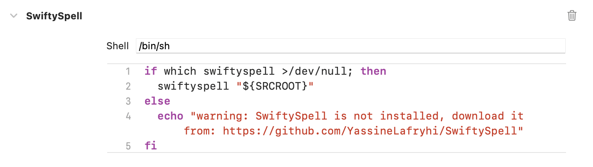
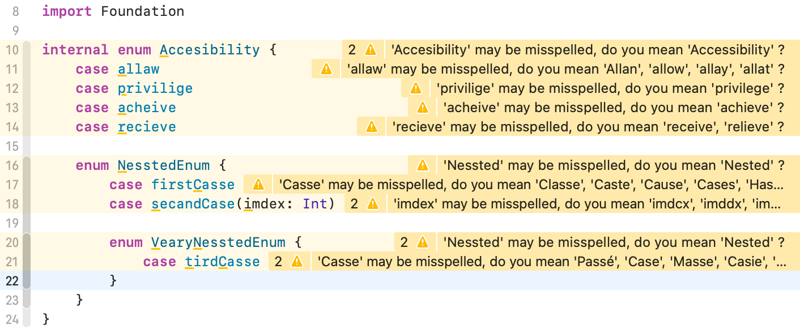
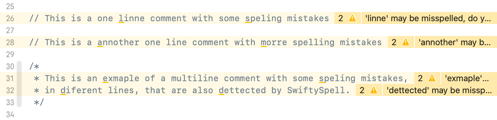
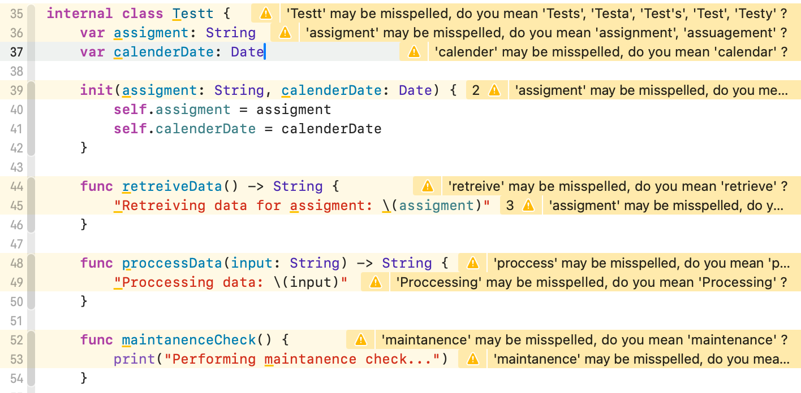
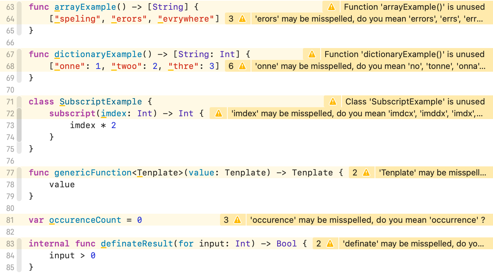

# SwiftySpell
> A tool for checking spelling in Swift code


## Installation
### Using CocoaPods
To install SwiftySpell using CocoaPods, add the following line to your `Podfile`, then run `pod install`:
```ruby
pod 'SwiftySpell'
```

### Manually
To install SwiftySpell manually, you can run the following commands:

```bash
cd ~/Downloads
LATEST_RELEASE=$(curl -s https://api.github.com/repos/YassineLafryhi/SwiftySpell/releases/latest | grep tag_name | cut -d '"' -f 4)
wget "https://github.com/YassineLafryhi/SwiftySpell/releases/download/${LATEST_RELEASE}/SwiftySpell-v${LATEST_RELEASE}.zip"
unzip "SwiftySpell-v${LATEST_RELEASE}.zip"
sudo mkdir -p /usr/local/bin
sudo mv swiftyspell /usr/local/bin/swiftyspell
sudo chmod +x /usr/local/bin/swiftyspell
```

## Configuration

> [!NOTE]
> `SwiftySpell` supports the same languages as the `NSSpellChecker` class from AppKit. To see the list of supported languages, run the following command: `swiftyspell languages`.

Configure SwiftySpell by running `swiftyspell init` command inside the project folder, then edit the generated `.swiftyspell.yml` configuration file.

This is an example of the configuration file:

```yml
# Languages to check
languages:
  - en
  - en_GB

# Directories/Files/Regular expressions to exclude
exclude:
  - Pods
  - Constants.swift

# Rules to apply
rules:
  - support_flat_case
  - support_one_line_comment
  - support_multi_line_comment
  - support_british_words
  - ignore_capitalization
  - ignore_swift_keywords
  - ignore_commonly_used_words
  - ignore_shortened_words
  - ignore_lorem_ipsum
  - ignore_html_tags
  - ignore_urls

# Words/Regular expressions to ignore
ignore:
  - \b[a-zA-Z]+able\b # Codable, Hashable ... (In Comments)
```

+ You can use a global configuration file for all your projects by placing it in your home directory (`~/.swiftyspell.yml`).

+ If you run `swiftyspell check .` without a configuration file, SwiftySpell will use the default configuration, which means it will :
  - Check spelling in English (en, en_GB).
  - Exclude the `Pods` directory, and the `Package.swift` and `R.generated.swift` files.
  - Apply all rules.

## Rules
To see the list of available rules, run the following command: `swiftyspell rules`.

## Usage

### Xcode
Integrate SwiftySpell into your Xcode project to get warnings displayed in the issue navigator.

To do so, select the project in the file navigator, then select the primary app target, and go to Build Phases. Click the + and select "New Run Script Phase". Insert the following script:
> If installed using CocoaPods :

```shell
"${PODS_ROOT}/SwiftySpell/SwiftySpell" check "${SRCROOT}"
```

> If installed manually :

```shell
if which swiftyspell >/dev/null; then
  swiftyspell check "${SRCROOT}"
else
  echo "warning: SwiftySpell is not installed, download it from: https://github.com/YassineLafryhi/SwiftySpell"
fi
```


Some examples of the warnings displayed in Xcode:

|  |  |
|----------------------------------|----------------------------------|
|  |  |

### Command Line
Run SwiftySpell from the command line by navigating to the directory containing the Swift project you want to check and running the following command:
```shell
swiftyspell check .
```

### As a pre-commit git hook
You can use SwiftySpell as a pre-commit git hook to check spelling before committing your changes. To do so, add the following to the `.git/hooks/pre-commit` file:
```shell
#!/bin/sh

output=$(swiftyspell check .)
count=$(echo "$output" | grep -c "may be misspelled")

if [ $count -gt 0 ]; then
  echo "Spelling errors found. Please fix them before committing (You can run 'swiftyspell fix .' to fix most of them)."
  exit 1
fi
```

## Correcting Spelling Mistakes (WIP)
To correct most of the spelling mistakes, run the following command:
```shell
swiftyspell fix .
```

## How to build

To build SwiftySpell from source, run the following commands:

### Using Xcode

```shell
git clone https://github.com/YassineLafryhi/SwiftySpell.git
cd SwiftySpell
tuist generate --no-open
xcodebuild -project SwiftySpell.xcodeproj -scheme SwiftySpellCLI -configuration Release build CONFIGURATION_BUILD_DIR=$(pwd)/Build
open Build
# Then you can move Build/SwiftySpellCLI to /usr/local/bin/swiftyspell
```

### Using Swift Package Manager

```shell
git clone https://github.com/YassineLafryhi/SwiftySpell.git
cd SwiftySpell
chmod +x build.sh && chmod +x install.sh
./build.sh
./install.sh
```

## TODOs

- [ ] Check spelling mistakes in Swift file names also
- [ ] Complete the implementation of Update command
- [ ] Implement swiftyspell:enable/swiftyspell:disable
- [ ] Integrate LanguageTool (pluralConsistency, homophoneCheck, ...)
- [ ] Add the possibility to take a Swift code as a String parameter and check it
- [ ] Use SyntaxRewriter while fixing the spelling mistakes
- [ ] Complete integrating Hunspell for spell checking on Linux
- [ ] Improve the implementation of ignore_capitalization rule (using the suggestions array is not always sufficient)
- [ ] Improve the implementation of support_flat_case rule (using the suggestions array is not always sufficient)
- [ ] If the misspelledWord starts with a word from the ignore list, remove it then recheck spelling of the resulting word
- [ ] Run check/fix on a single file
- [ ] Add reporter config (xcode (default), json, csv, ...)
- [ ] Add Severity config (error/warning) for every rule
- [ ] Enhance the Fix command to list suggestions and ask to choose one (If suggestions array contains more than 1 word)
- [ ] Support Cache to avoid checking unmodified files
- [ ] Warn about words that are in the yml config file but not found in the code
- [ ] Add more Unit Tests

## Contributing

Contributions are what make the open source community such an amazing place to be learn, inspire, and create. Any contributions you make are **greatly appreciated**.

1. Fork the Project
2. Create your Feature Branch (`git checkout -b feature/AmazingFeature`)
3. Commit your Changes (`git commit -m 'Add some AmazingFeature'`)
4. Push to the Branch (`git push origin feature/AmazingFeature`)
5. Open a Pull Request

## License
[MIT License](https://choosealicense.com/licenses/mit)
