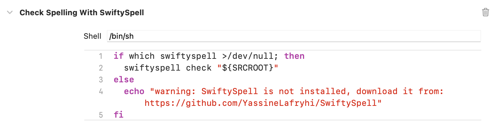

# SwiftySpell
> A tool for checking spelling in Swift code


## Installation
To install SwiftySpell, you can run the following commands:

```bash
cd ~/Downloads
wget https://github.com/YassineLafryhi/SwiftySpell/releases/download/0.9.0/SwiftySpell-v0.9.0
sudo mkdir -p /usr/local/bin
sudo mv SwiftySpell-v0.9.0 /usr/local/bin/swiftyspell
sudo chmod +x /usr/local/bin/swiftyspell
```

## Configuration

Configure SwiftySpell by adding a `.swiftyspell.yml` file inside the directory you'll run SwiftySpell from.
This is an example of the configuration file:

```yml
# Words to ignore
ignoreList:
  - iOS

# Regular expressions to exclude
excludePatterns:
  - \b[0-9a-fA-F]{6}\b # Color hex codes
  - \bhttps?:\/\/[^\s]+\b # URLs

# Files to exclude
excludeFiles:
  - Constants.swift

# Directories to exclude
excludeDirectories:
  - Pods # Exclude the Pods directory for a CocoaPods project
```

## Usage

### Xcode
Integrate SwiftySpell into your Xcode project to get warnings displayed in the issue navigator.

To do so, select the project in the file navigator, then select the primary app target, and go to Build Phases. Click the + and select "New Run Script Phase". Insert the following script:
```shell
if which swiftyspell >/dev/null; then
  swiftyspell "${SRCROOT}"
else
  echo "warning: SwiftySpell is not installed, download it from: https://github.com/YassineLafryhi/SwiftySpell"
fi
```


An example of the warnings displayed in Xcode:

| Warnings on the Editor area      | Warnings on the Issue Navigator  |
|----------------------------------|----------------------------------|
|  |  |

### Command Line
Run SwiftySpell from the command line by navigating to the directory containing the Swift project you want to check and running the following command:
```shell
swiftyspell .
```

### As a pre-commit git hook
You can use SwiftySpell as a pre-commit git hook to check spelling before committing your changes. To do so, add the following to the `.git/hooks/pre-commit` file:
```shell
#!/bin/sh
if [ -n "$(swiftyspell .)" ]; then
  echo "Spelling errors found. Please fix them before committing."
  exit 1
fi
```
  
## How to build

To build SwiftySpell from source, run the following commands:

```shell
git clone https://github.com/YassineLafryhi/SwiftySpell.git
cd SwiftySpell
xcodebuild -project SwiftySpell.xcodeproj -scheme SwiftySpell -configuration Release build CONFIGURATION_BUILD_DIR=$(pwd)/Build
open Build
# Then you can move Build/SwiftySpell to /usr/local/bin/swiftyspell
```

## Contributing

Contributions are what make the open source community such an amazing place to be learn, inspire, and create. Any contributions you make are **greatly appreciated**.

1. Fork the Project
2. Create your Feature Branch (`git checkout -b feature/AmazingFeature`)
3. Commit your Changes (`git commit -m 'Add some AmazingFeature'`)
4. Push to the Branch (`git push origin feature/AmazingFeature`)
5. Open a Pull Request

## License
[Apache License 2.0](https://choosealicense.com/licenses/apache-2.0)
